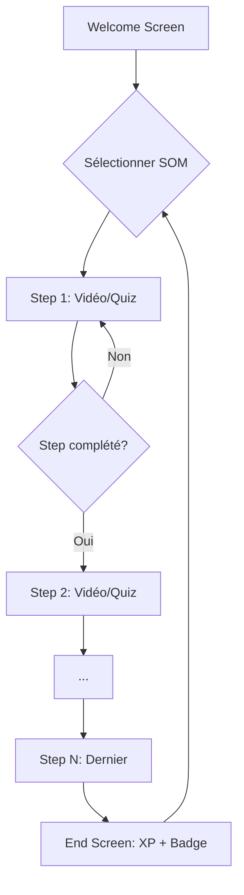

# 1.03 - User Journey LMS

> Directive source : `02.Directives/app_factory/phase1/1.03_user_journey.md`

---

## 1. Philosophie LINEAR FIRST ✅

Le POC respecte la philosophie linéaire :

```javascript
// navigation.js ligne 53
export function prevStep() {
    alert("⚠️ Progression linéaire : impossible de revenir en arrière.");
}
```

**Validation** : ✅ Pas de retour arrière possible dans un cours.

---

## 2. Diagramme du Funnel



**Analyse linéarité** :
- ✅ Une seule entrée (Welcome)
- ✅ Un seul chemin par cours (Step 1 → 2 → ... → N)
- ✅ Pas de branches multiples
- ✅ Boucle unique : fin de cours → retour sélection

---

## 3. Liste des Routes

| # | Écran | URL | Origine | Destination |
|---|-------|-----|---------|-------------|
| 1 | Welcome | `/` | Entrée app | Sélection SOM |
| 2 | Course View | `/?som=courseId` | Click SOM sidebar | Step courant |
| 3 | Step N | `/?som=courseId` | Step N-1 complété | Step N+1 |
| 4 | End Screen | `/?som=courseId` | Dernier step | Retour Welcome |

---

## 4. Prérequis par Écran

| Écran | Prérequis technique | Prérequis métier |
|-------|---------------------|------------------|
| Welcome | - | - |
| Course View | `?som` présent | Cours existe |
| Step N | `signals.can_access_step >= N` | Steps précédents complétés |
| End Screen | Tous steps complétés | - |

---

## 5. Mécanismes de Navigation

| Action | Implémentation | Linéaire ? |
|--------|----------------|------------|
| Avancer (Suivant) | `nextStep()` + validation step_completed | ✅ |
| Reculer | `prevStep()` → alert bloquant | ✅ |
| Changer de cours | Sidebar click → `loadCourse()` | ✅ |
| Refresh | URL `?som=X` + `can_access_step` | ✅ |
| Quitter cours | Click autre SOM dans sidebar | ✅ |

---

## 6. Template Cahier de Recette (Phase 5)

### Scénario 1 : Happy Path

| Step | Action | Résultat attendu |
|------|--------|------------------|
| 1 | Accès app | Welcome screen |
| 2 | Click cours dans sidebar | Step 1 affiché |
| 3 | Voir vidéo 100% | Bouton Suivant actif |
| 4 | Click Suivant | Step 2 affiché |
| 5 | Quiz passé | XP ajouté, Suivant actif |
| 6 | Compléter tous steps | End screen, badge |
| 7 | Click Continuer | Retour Welcome |

### Scénario 2 : Resume

| Step | Action | Résultat attendu |
|------|--------|------------------|
| 1 | Quitter à step 3 | - |
| 2 | Revenir sur app | Step 3 affiché (pas step 1) |

### Scénario 3 : Tentative retour arrière

| Step | Action | Résultat attendu |
|------|--------|------------------|
| 1 | Sur step 5 | - |
| 2 | Click "Précédent" | Alert "impossible de revenir" |

---

## 7. GAPs Identifiés

| ID | GAP | Sévérité | Description |
|----|-----|----------|-------------|
| GAP-203 | Step dans URL | P3 | Pas de `?step=N` (nice-to-have, resume fonctionne déjà) |

---

*Créé le : 2024-12-28*
