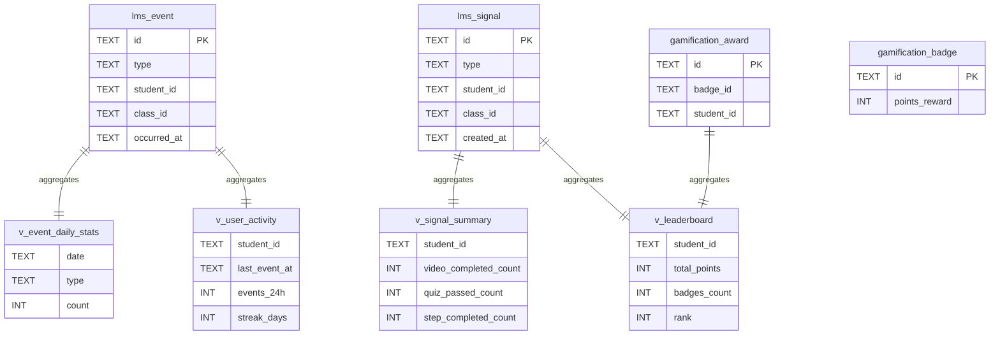

# 1.05 - ERD LMS

## ERD Complet

```mermaid
erDiagram
    %% ===== UNIFIED.TO: LMS =====
    lms_student {
        TEXT id PK
        TEXT name
        TEXT first_name
        TEXT last_name
        TEXT emails_json
        TEXT address_json
        TEXT telephones_json
        TEXT image_url
        TEXT raw_json
        TEXT created_at
        TEXT updated_at
    }
    
    lms_instructor {
        TEXT id PK
        TEXT name
        TEXT first_name
        TEXT last_name
        TEXT emails_json
        TEXT telephones_json
        TEXT title
        TEXT image_url
        TEXT raw_json
        TEXT created_at
        TEXT updated_at
    }
    
    lms_course {
        TEXT id PK
        TEXT name
        TEXT description
        TEXT categories_json
        TEXT media_json
        TEXT instructor_ids_json
        TEXT student_ids_json
        TEXT currency
        REAL price_amount
        INT is_active
        INT is_private
        TEXT languages_json
        TEXT raw_json
        TEXT created_at
        TEXT updated_at
    }
    
    lms_class {
        TEXT id PK
        TEXT course_id FK
        TEXT name
        TEXT description
        TEXT media_json
        TEXT instructor_ids_json
        TEXT student_ids_json
        INT order_index
        TEXT step_type
        TEXT content_md
        TEXT languages_json
        TEXT raw_json
        TEXT created_at
        TEXT updated_at
    }
    
    %% ===== EXTENSION: GAMIFICATION =====
    gamification_badge {
        TEXT id PK
        TEXT name
        TEXT description
        TEXT icon_url
        TEXT type
        TEXT category
        TEXT rarity
        INT points_reward
        TEXT criteria_json
        INT is_active
        TEXT metadata_json
        TEXT raw_json
        TEXT created_at
        TEXT updated_at
    }
    
    gamification_award {
        TEXT id PK
        TEXT badge_id FK
        TEXT student_id FK
        TEXT course_id
        TEXT class_id
        TEXT awarded_at
        TEXT context_json
        TEXT raw_json
        TEXT created_at
    }
    
    %% ===== EXTENSION: EVENT SOURCING =====
    lms_event {
        TEXT id PK
        TEXT type
        TEXT student_id FK
        TEXT course_id
        TEXT class_id
        TEXT occurred_at
        TEXT payload_json
        TEXT context_json
        TEXT created_at
    }
    
    lms_signal {
        TEXT id PK
        TEXT type
        TEXT student_id FK
        TEXT course_id
        TEXT class_id
        TEXT source_event_ids
        TEXT data_json
        TEXT created_at
    }
    
    %% ===== MATERIALIZED VIEW =====
    v_user_progress {
        TEXT student_id PK
        TEXT class_id PK
        TEXT course_id
        INT video_max_position_sec
        INT video_duration_sec
        INT video_completed
        TEXT video_completed_at
        INT quiz_passed
        INT quiz_score
        INT quiz_max_score
        TEXT quiz_passed_at
        TEXT updated_at
    }
    
    %% ===== RELATIONS =====
    lms_course ||--o{ lms_class : "contains"
    lms_instructor }o--o{ lms_course : "teaches"
    lms_student }o--o{ lms_course : "enrolled"
    
    lms_student ||--o{ lms_event : "emits"
    lms_student ||--o{ gamification_award : "earns"
    gamification_badge ||--o{ gamification_award : "awarded_as"
    
    lms_class ||--o{ lms_event : "tracked_by"
    lms_event }o--|| lms_signal : "projects_to"
    lms_event }o--|| v_user_progress : "materializes"
```

## ERD Monitoring

## Mapping Unified.to

| Domaine | Table | Unified.to | Status |
|---------|-------|------------|--------|
| LMS | lms_student | LmsStudent | ✅ |
| LMS | lms_instructor | LmsInstructor | ✅ |
| LMS | lms_course | LmsCourse | ✅ |
| LMS | lms_class | LmsClass | ✅ |

## Extensions

| Table | Type | Style Unified.to |
|-------|------|------------------|
| gamification_badge | Entity | ✅ |
| gamification_award | Fact | ✅ |
| lms_event | Fact (event-sourcing) | ✅ |
| lms_signal | Derived | ✅ |
| v_user_progress | Materialized view | ✅ |

## GAPs

| ID | Description | Sévérité |
|----|-------------|----------|
| GAP-501 | Pas de organization_id (mode agence) | P3 |
| GAP-502 | Pas de multi-locale | P3 |
| GAP-1205 | Table lms_student manquante (à créer) | P1 |
| GAP-1206 | Table lms_instructor manquante (à créer) | P1 |
| GAP-1207 | Migration crm_contact → lms_student | P1 |

---

*Mis à jour le : 2024-12-28*
