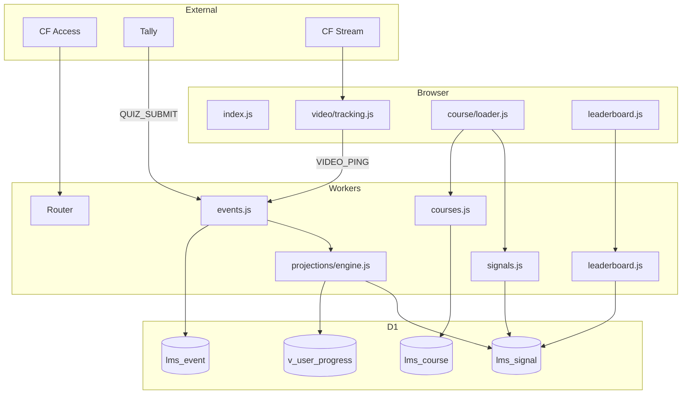
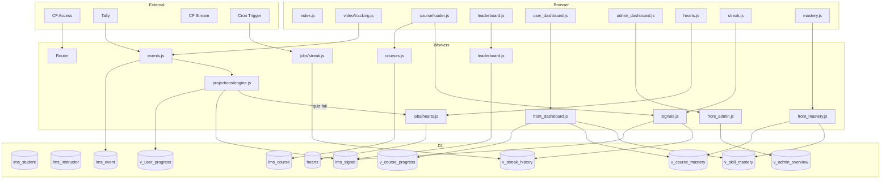

# 1.08 - Flux Architecture LMS

## 1. Flux EXISTANT

**Couverture existante :**
- ✅ Video tracking (ping → event → projection)
- ✅ Quiz via Tally webhook
- ✅ Course loading + progress
- ✅ Leaderboard basique
- ✅ Auth Cloudflare Access

---

## 2. Flux CIBLE (basé sur 1.01)

---

## 3. Analyse GAP (Existant vs Cible)

| Composant | Existant | Cible | GAP |
|-----------|----------|-------|-----|
| **Front** |
| user_dashboard.js | ❌ | ✅ | GAP-801 |
| admin_dashboard.js | ❌ | ✅ | GAP-802 |
| hearts.js | ❌ | ✅ | GAP-804 |
| streak.js | ❌ | ✅ | GAP-803 |
| mastery.js | ❌ | ✅ | GAP-805 |
| **Back** |
| front_dashboard.js | ❌ | ✅ | GAP-801 |
| front_admin.js | ❌ | ✅ | GAP-802 |
| front_mastery.js | ❌ | ✅ | GAP-805 |
| jobs/streak.js | ❌ | ✅ | GAP-803 |
| jobs/hearts.js | ❌ | ✅ | GAP-804 |
| **DB** |
| v_course_progress | ❌ | ✅ | GAP-601 |
| v_course_mastery | ❌ | ✅ | GAP-602 |
| v_skill_mastery | ❌ | ✅ | GAP-603 |
| v_admin_overview | ❌ | ✅ | GAP-604 |
| v_streak_history | ❌ | ✅ | GAP-605 |
| hearts table | ❌ | ✅ | GAP-806 |

---

## 4. GAPs Nouveaux (1.08)

| ID | Description | Sévérité |
|----|-------------|----------|
| GAP-805 | Flux mastery (front + back) | P1 |
| GAP-806 | Table hearts manquante | P2 |

*Note: GAP-801→804 déjà identifiés, GAP-601→605 viennent de 1.06*

---

*Créé le : 2024-12-28*
