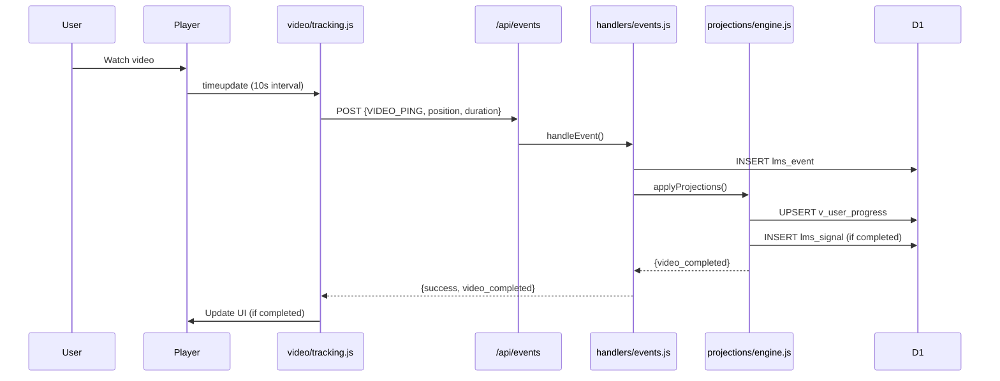
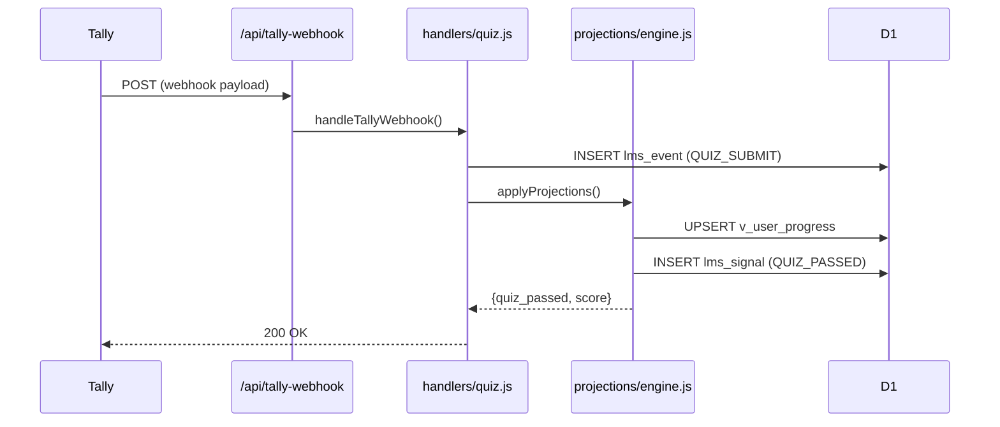
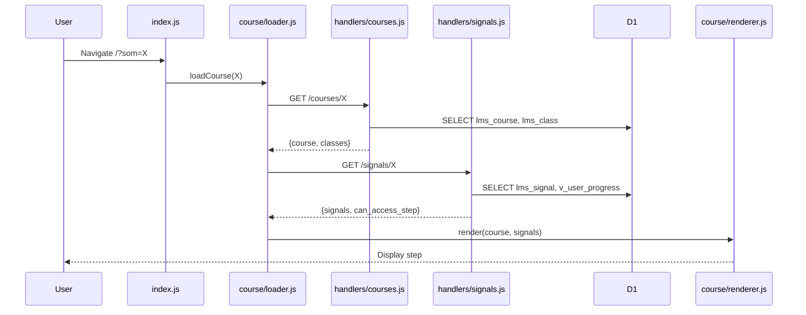
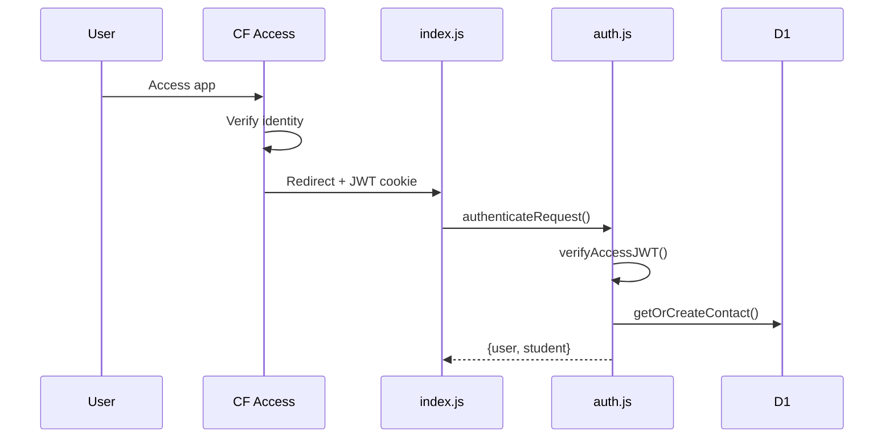
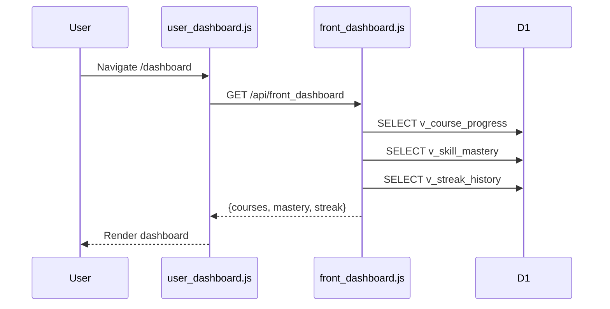
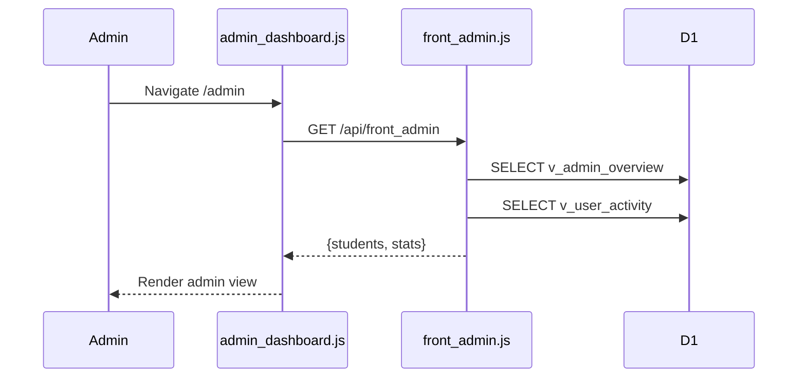
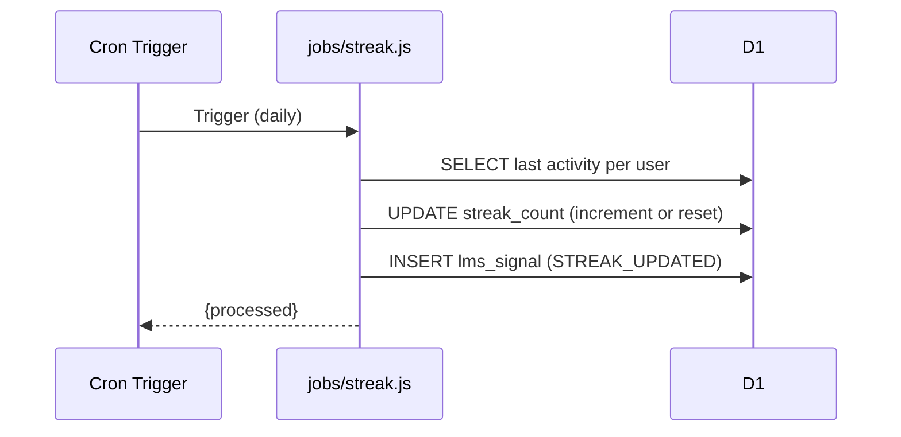
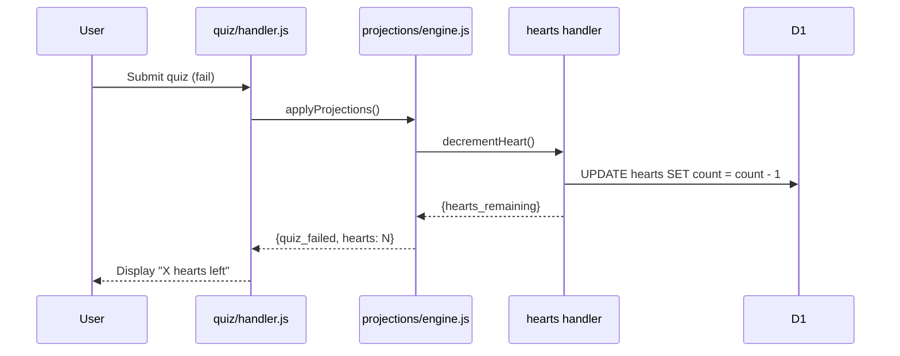

# 1.10 - Sequences LMS

## 0. Liste Features

### Existantes (POC)

| Feature | Status |
|---------|--------|
| Video tracking | ✅ |
| Quiz (Tally) | ✅ |
| Course loading | ✅ |
| Leaderboard | ✅ |
| Auth (CF Access) | ✅ |

### Cibles (1.01)

| Feature | Status |
|---------|--------|
| User dashboard | ❌ |
| Admin dashboard | ❌ |
| Mastery % | ❌ |
| Streaks | ❌ |
| Hearts/lives | ❌ |

---

## 1. Sequences EXISTANTES

### Video Tracking

**Points debug**: VT→API (payload), HE→DB (event stored), PE→DB (projection applied)

### Quiz Submission (Tally)

**Points debug**: WH (signature verify), HQ→DB (event), PE (projection result)

### Course Loading

**Points debug**: CL→HC (course data), CL→HS (signals), CR (render)

### Auth Flow

**Points debug**: AUTH (JWT verify), DB (student created/found)

---

## 2. Sequences CIBLES

### User Dashboard

**Status**: ❌ Non implémenté (GAP-801, GAP-601→603)

### Admin Dashboard

**Status**: ❌ Non implémenté (GAP-802, GAP-604)

### Streak Calculation (Cron)

**Status**: ❌ Non implémenté (GAP-803)

### Hearts/Lives

**Status**: ❌ Non implémenté (GAP-804, GAP-806)

---

## 3. Analyse Non-linéarités

| Sequence | Non-linéarité | Status |
|----------|---------------|--------|
| Video tracking | Loop 10s → single event | ✅ OK |
| Quiz Tally | Webhook async | ✅ OK (fire & forget) |
| Course loading | 2 API calls séquentiels | ⚠️ Pourrait être 1 seul |
| Projections | Chain sync | ✅ OK |

**GAP potentiel**: Course loading fait 2 calls (courses + signals). Pourrait être fusionné.

---

## 4. GAPs

| ID | Feature | Séquence manquante | Sévérité |
|----|---------|-------------------|----------|
| GAP-1001 | User dashboard | Flux complet front→back→views | P1 |
| GAP-1002 | Admin dashboard | Flux complet front→back→views | P1 |
| GAP-1003 | Streak cron | Job daily + signal | P2 |
| GAP-1004 | Hearts decrement | Projection + update | P2 |
| GAP-1005 | Course loading | Fusion 2 calls en 1 | P3 |

---

*Créé le : 2024-12-28*

