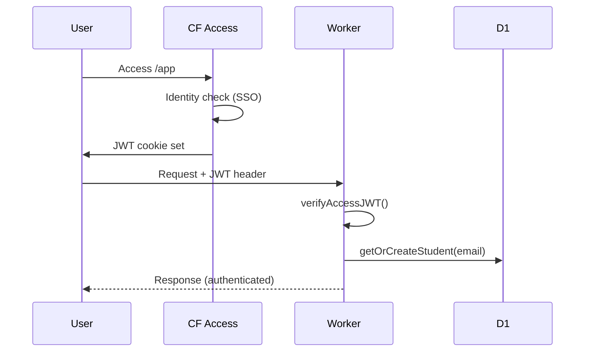

# 1.12 - Auth & Access LMS

## 1. Auth EXISTANTE

### Mécanisme

| Composant | Implémentation |
|-----------|----------------|
| Provider | Cloudflare Access |
| Token | JWT (`Cf-Access-Jwt-Assertion` header) |
| Vérification | `verifyAccessJWT()` → JWKS |
| User store | `crm_contact` (à migrer → lms_student) |
| Auto-create | ✅ `getOrCreateContact()` (à renommer) |

### Flow



### Endpoints Protection (de 1.07)

| Endpoint | Protection | Status |
|----------|------------|--------|
| `/api/health` | Public | ✅ |
| `/api/tally-webhook` | Signature/Secret | ✅ |
| `/api/events` | JWT | ✅ |
| `/api/courses` | JWT | ✅ |
| `/api/signals/*` | JWT | ✅ |
| `/api/leaderboard` | JWT | ✅ |
| `/api/badges` | JWT | ✅ |
| `/api/students/:id` | JWT | ❌ (à créer) |

---

## 2. Auth CIBLE

### Rôles (Unified.to aligned)

| Rôle | Description | Source Table |
|------|-------------|--------------|
| guest | Non authentifié | - |
| student | Apprenant | lms_student |
| instructor | Créateur de contenu | lms_instructor |
| admin | Full access | lms_instructor + is_admin flag |

### Intents (pattern IAMPAM)

> L'intent est défini côté serveur, JAMAIS par le client.

| Intent | Rôles autorisés | Endpoints |
|--------|-----------------|-----------|
| `session:read` | student, instructor, admin | GET /api/auth/session |
| `course:read` | student, instructor, admin | GET /api/courses, GET /api/courses/:id |
| `course:write` | instructor (own), admin | POST/PUT/DELETE /api/courses |
| `class:read` | student, instructor, admin | (via course) |
| `class:write` | instructor (own), admin | CRUD /api/classes |
| `event:write` | student (own), instructor, admin | POST /api/events, POST /api/events/batch |
| `signal:read` | student (own), instructor, admin | GET /api/signals/* |
| `signal:reset` | student (own), admin | POST /api/signals/*/reset |
| `badge:read` | student, instructor, admin | GET /api/badges |
| `badge:write` | admin | POST/PUT/DELETE /api/badges |
| `student:read` | admin | GET /api/students |
| `student:write` | admin | CRUD /api/students |
| `instructor:read` | admin | GET /api/instructors |
| `instructor:write` | admin | CRUD /api/instructors |
| `leaderboard:read` | student, instructor, admin | GET /api/leaderboard |
| `dashboard:read` | student, instructor, admin | GET /api/front_dashboard |
| `mastery:read` | student (own), instructor, admin | GET /api/front_mastery |
| `admin:read` | admin | GET /api/front_admin |
| `job:execute` | system (cron secret) | POST /api/jobs/* |

### Matrice d'Accès Complète

#### Endpoints existants

| Endpoint | guest | student | instructor | admin |
|----------|-------|---------|------------|-------|
| GET /api/health | ✅ | ✅ | ✅ | ✅ |
| POST /api/tally-webhook | secret | secret | secret | secret |
| GET /api/auth/session | ❌ | ✅ | ✅ | ✅ |
| POST /api/events | ❌ | ✅ own | ✅ | ✅ |
| GET /api/courses | ❌ | ✅ | ✅ | ✅ |
| GET /api/courses/:id | ❌ | ✅ | ✅ | ✅ |
| GET /api/signals/:courseId | ❌ | ✅ own | ✅ | ✅ |
| POST /api/signals/:id/reset | ❌ | ✅ own | ❌ | ✅ |
| GET /api/badges | ❌ | ✅ | ✅ | ✅ |
| GET /api/student | ❌ | ✅ own | ❌ | ✅ |
| GET /api/leaderboard | ❌ | ✅ | ✅ | ✅ |

#### Endpoints CRUD cibles (de 1.07)

| Endpoint | guest | student | instructor | admin |
|----------|-------|---------|------------|-------|
| POST /api/courses | ❌ | ❌ | ✅ | ✅ |
| PUT /api/courses/:id | ❌ | ❌ | ✅ own | ✅ |
| DELETE /api/courses/:id | ❌ | ❌ | ✅ own | ✅ |
| CRUD /api/classes | ❌ | ❌ | ✅ own | ✅ |
| POST /api/badges | ❌ | ❌ | ❌ | ✅ |
| PUT /api/badges/:id | ❌ | ❌ | ❌ | ✅ |
| DELETE /api/badges/:id | ❌ | ❌ | ❌ | ✅ |
| CRUD /api/students | ❌ | ❌ | ❌ | ✅ |
| CRUD /api/instructors | ❌ | ❌ | ❌ | ✅ |

#### Endpoints front_ cibles (de 1.07)

| Endpoint | guest | student | instructor | admin |
|----------|-------|---------|------------|-------|
| GET /api/front_dashboard | ❌ | ✅ | ✅ | ✅ |
| GET /api/front_mastery/:id | ❌ | ✅ own | ✅ | ✅ |
| GET /api/front_admin | ❌ | ❌ | ❌ | ✅ |

#### Jobs (cron)

| Endpoint | Protection |
|----------|------------|
| POST /api/jobs/streak_check | CRON_SECRET |
| POST /api/jobs/cleanup | CRON_SECRET |

---

## 3. Intégration User Journey (1.03)

### Pages et Auth

| Page | URL | Auth requise | Rôle minimum | Prérequis |
|------|-----|--------------|--------------|-----------|
| Welcome | `/` | ✅ CF Access | student | - |
| Course View | `/?som=X` | ✅ CF Access | student | Cours existe |
| Step N | `/?som=X` | ✅ CF Access | student | `can_access_step >= N` |
| End Screen | `/?som=X` | ✅ CF Access | student | Tous steps complétés |
| User Dashboard | `/dashboard` (futur) | ✅ CF Access | student | - |
| Admin Dashboard | `/admin` (futur) | ✅ CF Access | admin | - |

### Cohérence

- ✅ Toutes les pages sont derrière CF Access (pas de mode guest actuellement)
- ✅ La linéarité est gérée par `signals.can_access_step`, pas par auth
- ⚠️ Pas de page admin actuellement (GAP-106)
- ⚠️ Pas de distinction student/instructor côté frontend

---

## 4. Pattern Intent+Guard (IAMPAM cible)

> Référence : `1.12_appendix_TPB_IAMPAM.md`

### Résolution du rôle

```javascript
// Cible - worker_api/auth.js
async function resolveRole(email, db) {
  // Check instructor first (includes admin)
  const instructor = await db.prepare(
    'SELECT id, is_admin FROM lms_instructor WHERE emails_json LIKE ?'
  ).bind(`%${email}%`).first();
  
  if (instructor) {
    return instructor.is_admin ? 'admin' : 'instructor';
  }
  
  // Check student
  const student = await db.prepare(
    'SELECT id FROM lms_student WHERE emails_json LIKE ?'
  ).bind(`%${email}%`).first();
  
  return student ? 'student' : null;  // null = no access
}
```

### Guard middleware

```javascript
// Cible - worker_api/middleware/guard.js
const INTENT_ROLES = {
  'course:read':   ['student', 'instructor', 'admin'],
  'course:write':  ['instructor', 'admin'],
  'event:write':   ['student', 'instructor', 'admin'],
  'admin:read':    ['admin'],
  // ...
};

export function guard(intent) {
  return async (request, env, ctx, next) => {
    const user = ctx.user;
    if (!user) return new Response('Unauthorized', { status: 401 });
    
    const allowedRoles = INTENT_ROLES[intent];
    if (!allowedRoles.includes(user.role)) {
      return new Response('Forbidden', { status: 403 });
    }
    
    return next();
  };
}

// Usage
app.get('/api/courses', guard('course:read'), handleListCourses);
app.post('/api/courses', guard('course:write'), handleCreateCourse);
```

### Filtrage D1 (équivalent RLS)

```javascript
// Cible - worker_api/db/secure-query.js
export async function secureQuery(db, table, user, options = {}) {
  let roleFilter = '';
  
  switch (user.role) {
    case 'student':
      roleFilter = 'student_id = ?';  // own data only
      break;
    case 'instructor':
      roleFilter = `course_id IN (
        SELECT id FROM lms_course WHERE instructor_ids_json LIKE ?
      )`;  // own courses
      break;
    case 'admin':
      roleFilter = '1=1';  // all data
      break;
  }
  
  // ... apply filter
}
```

---

## 5. Analyse GAP

### Auth

| Aspect | Existant | Cible | GAP |
|--------|----------|-------|-----|
| SSO | ✅ CF Access | ✅ | OK |
| JWT verify | ✅ | ✅ | OK |
| User table | crm_contact | lms_student | GAP-1207 |
| Rôles | ❌ (tous identiques) | ✅ multi-rôle | GAP-1201 |
| Permissions | ❌ implicite | ✅ matrice | GAP-1202 |
| RBAC | ❌ | ✅ | GAP-1203 |
| Audit log | ❌ | ✅ | GAP-1204 |
| resolveRole() | ❌ | ✅ | GAP-1208 |
| guard() middleware | ❌ | ✅ | GAP-1209 |

---

## 6. GAPs

| ID | Aspect | Existant | Cible | Sévérité |
|----|--------|----------|-------|----------|
| GAP-1201 | Rôles | Tous identiques | student/instructor/admin | P2 |
| GAP-1202 | Matrice permissions | Implicite | Explicite (section 2) | P2 |
| GAP-1203 | RBAC enforcement | ❌ | Middleware RBAC | P2 |
| GAP-1204 | Audit log | ❌ | Log qui fait quoi | P3 |
| GAP-1205 | Table lms_student | ❌ | Créer (Unified.to) | P1 |
| GAP-1206 | Table lms_instructor | ❌ | Créer (Unified.to) | P1 |
| GAP-1207 | User table | crm_contact | lms_student | P1 |
| GAP-1208 | resolveRole() | ❌ | Fonction de résolution rôle | P2 |
| GAP-1209 | guard() middleware | ❌ | Pattern Intent+Guard | P2 |
| GAP-1210 | Input Sanitization | Non formalisé | Checks explicites (parameterized queries, escape HTML, validation types, limits, whitelist) | P2 |

**Nouveau GAP identifié** :
- Input Sanitization : pas de checklist formelle de protection contre les injections SQL, XSS, etc. À ajouter : audit des requêtes SQL (parameterized?), escape HTML, validation des types, limites de taille, whitelist caractères.

---

## 7. Outputs pour 1.13

### Rôles Définis

- `student` : accès cours, events propres, leaderboard, dashboard user
- `instructor` : + CRUD cours propres, classes propres
- `admin` : full access, CRUD students/instructors/badges, admin dashboard

### Pages par Rôle

| Page | student | instructor | admin |
|------|---------|------------|-------|
| Welcome | ✅ | ✅ | ✅ |
| Course View | ✅ | ✅ | ✅ |
| User Dashboard | ✅ | ✅ | ✅ |
| Course Edit | ❌ | ✅ own | ✅ |
| Admin Dashboard | ❌ | ❌ | ✅ |

### Intents exportés

```javascript
// Pour 1.13 - panels par intent
const PANEL_INTENTS = {
  'student': ['dashboard:read', 'course:read', 'leaderboard:read'],
  'instructor': ['dashboard:read', 'course:read', 'course:write', 'leaderboard:read'],
  'admin': ['admin:read', 'student:read', 'instructor:read', ...],
};
```

---

*Mis à jour le : 2024-12-28*
