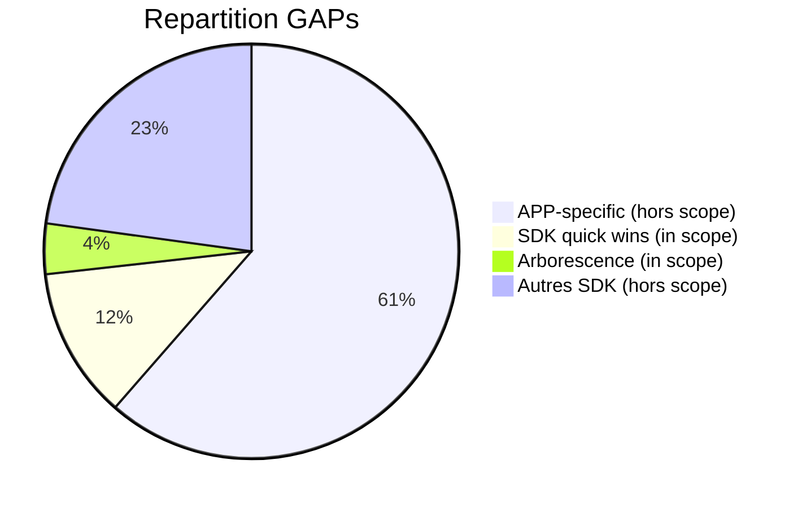

# LMS First Pareto Speedrun

Ce plan cible les **quick wins** parmi les 127 GAPs : les items qui rendent le code plus clean et robuste avec le minimum d'effort.

**Criteres de selection** : < 30 min chacun, ROI eleve, pas de refactoring majeur.

---

## BIFURCATION : Tests + Entropy First

> **Date** : 2024-12-29
> **Raison** : Le déroulement du plan aurait causé une augmentation d'entropie critique

### Pourquoi la bifurcation ?

En "vibe coding" avec LLM, l'entropie est le risque #1 :
- Code dupliqué généré automatiquement
- Fichiers legacy conservés "au cas où"
- Tests insuffisants pour valider les changements

**Sans tests + entropy check, le speedrun aurait causé la perte du projet.**

### Ce qui a été fait (hors plan initial)

| Item | Status | Impact |
|------|--------|--------|
| E2E Test Fixtures API | ✅ | Tests reproductibles via `/api/test/seed` |
| E2E Test Prompt Gherkin | ✅ | Guide browser agent pour tests frontend |
| Entropy Check (12 checks) | ✅ | Détection auto duplication, dead code, legacy |
| CSS Modularisation | ✅ | styles.css (1140 lignes) → 5 fichiers |
| Frontend Logger | ✅ | DEBUG_MODE pour logs propres en prod |
| Legacy Cleanup | ✅ | player_embed.js, /api/video-event supprimés |
| DevOps Scripts Python | ✅ | deploy.py (backend+frontend), verify, secrets |

### Résultat Entropy Check

```
Before: 103 violations (1 P1, 10 P2, 92 P3)
After:  0 violations ✅
```

### Prochaines étapes

Reprendre le plan original à partir de **Tier 2** (les Tiers 1, 3, 4, 5 sont faits).

---

## Scope



**In scope** : ~20 GAPs sur 127 (le vrai Pareto)

**Effort total** : ~85 lignes de code + config---

## Tier 1 : Install Packages (5 min) ✅ FAIT

Packages qui resolvent plusieurs GAPs d'un coup :

```bash
yarn add zod  # pino non utilisé - logger vanilla JS
```

| Package | GAPs resolus | Usage | Status |
|---------|--------------|-------|--------|
| `zod` | GAP-710, GAP-1210 | Input validation + sanitization | ✅ |
| ~~`pino`~~ | ~~GAP-1101, GAP-1103, GAP-1104~~ | Logger vanilla JS à la place | ✅ |

**Note** : CASL, i18next, etc. sont hors scope speedrun (trop de design necessaire).

---

## Tier 2 : Backend Quick Wins (~85 lignes)

### 2.1 Logger structure (~15 lignes)

**GAPs** : GAP-1101, GAP-1103, GAP-1104Creer [`backend/utils/log.js`](tpb_system/04.Execution/lms/backend/utils/log.js) :

```javascript
import pino from 'pino';

const logger = pino({ level: 'info' });

export const log = (component) => ({
  info: (msg, data) => logger.info({ component, ...data }, msg),
  error: (msg, data) => logger.error({ component, ...data }, msg),
  audit: (action, data) => logger.info({ component, action, audit: true, ...data }, action)
});
```


### 2.2 Trace middleware (~10 lignes)

**GAP** : GAP-1106Creer [`backend/middleware/trace.js`](tpb_system/04.Execution/lms/backend/middleware/trace.js) :

```javascript
export const addTraceId = (request) => {
  const traceId = request.headers.get('x-trace-id') || crypto.randomUUID();
  return { traceId };
};

export const withTraceHeader = (response, traceId) => {
  response.headers.set('x-trace-id', traceId);
  return response;
};
```


### 2.3 Health endpoint enrichi (~20 lignes)

**Best practice** : Deja present mais a enrichir dans [`backend/index.js`](tpb_system/04.Execution/lms/worker_api/index.js)

```javascript
if (path === '/api/health') {
  const dbCheck = await env.DB.prepare('SELECT 1').first().catch(() => null);
  return jsonResponse({
    status: dbCheck ? 'healthy' : 'degraded',
    checks: {
      database: { status: dbCheck ? 'up' : 'down' }
    },
    version: '2.0.0',
    timestamp: new Date().toISOString()
  }, 200, request);
}
```


### 2.4 Validation Zod (~25 lignes)

**GAPs** : GAP-710, GAP-1210Creer [`backend/schemas/events.js`](tpb_system/04.Execution/lms/backend/schemas/events.js) :

```javascript
import { z } from 'zod';

export const videoPingSchema = z.object({
  type: z.literal('VIDEO_PING'),
  course_id: z.string().min(1),
  class_id: z.string().min(1),
  payload: z.object({
    position_sec: z.number().min(0),
    duration_sec: z.number().positive()
  })
});

export const quizSubmitSchema = z.object({
  type: z.literal('QUIZ_SUBMIT'),
  course_id: z.string().min(1),
  class_id: z.string().min(1),
  payload: z.object({
    score: z.number().min(0),
    max_score: z.number().positive()
  })
});

export const validateEvent = (body) => {
  const schemas = { VIDEO_PING: videoPingSchema, QUIZ_SUBMIT: quizSubmitSchema };
  return schemas[body.type]?.safeParse(body) || { success: false, error: 'Unknown type' };
};
```

---

## Tier 3 : Arborescence (refacto mecanique) ✅ FAIT

**GAPs** : GAP-901, GAP-902, GAP-903, GAP-904, GAP-905

| Action | De | Vers | Status |
|--------|-----|------|--------|
| Renommer | `worker_api/` | `backend/` | ✅ |
| Deplacer | `schema.sql` | `db/schema.sql` | ✅ |
| Deplacer | `tests/` | `scripts/tests/` | ✅ |
| Deplacer | `deploy.sh` | `scripts/devops/deploy.py` | ✅ (Python) |
| Deplacer | `*.py` (racine) | `scripts/` | ✅ |

**Impact** : `wrangler.toml` mis a jour (main = backend/index.js)

---

## Tier 4 : Security Headers (config Cloudflare) ✅ FAIT

**GAP** : GAP-1406

Implémenté dans `backend/cors.js` (pas via Dashboard) :

```javascript
// Security headers ajoutés à toutes les réponses
'X-Content-Type-Options': 'nosniff',
'X-Frame-Options': 'DENY',
'X-XSS-Protection': '1; mode=block',
'Referrer-Policy': 'strict-origin-when-cross-origin',
'Strict-Transport-Security': 'max-age=31536000'
```

---

## Tier 5 : Scripts DevOps simples ✅ FAIT (Python)

Scripts convertis en Python (cross-platform) :

### deploy.py ✅

```bash
python scripts/devops/deploy.py              # Tout
python scripts/devops/deploy.py --backend    # Backend seul
python scripts/devops/deploy.py --frontend   # Frontend seul
```

### verify_deploy.py ✅

```bash
python scripts/devops/verify_deploy.py
# Vérifie API health + frontend serving HTML
```

### check_secrets.py ✅

```bash
python scripts/devops/check_secrets.py
# Liste required + optional secrets avec couleurs
```

---

## Hors scope speedrun (mise à jour)

| Categorie | GAPs | Raison | Status |
|-----------|------|--------|--------|
| RBAC complet | GAP-1201 a 1209 | Design necessaire (roles, matrice) | TODO |
| Idempotency | GAP-711 | Necessite setup KV | TODO |
| SDK Events | GAP-401 a 405 | Refacto tpb-events | TODO |
| ~~Frontend CSS~~ | ~~GAP-1611 a 1614~~ | ~~Refacto lourd~~ | ✅ FAIT (entropy priority) |
| Features | GAP-101 a 123 | Nouvelles features, pas cleanup | TODO |
| Rate limiting | GAP-1415 | Config CF payante ou middleware | TODO |

---

## Ordre d'execution (réel)

1. ✅ **Tier 3** (Arborescence) - Structure conforme
2. ✅ **Tier 1** (yarn add zod) - Setup deps
3. ✅ **Tier 2.1** (Logger) - backend/utils/log.js
4. ✅ **Tier 2.2** (Trace) - backend/middleware/trace.js
5. ✅ **Tier 2.4** (Validation) - backend/schemas/events.js
6. ✅ **Tier 2.3** (Health) - /api/health enrichi
7. ✅ **Tier 4** (Security Headers) - cors.js
8. ✅ **Tier 5** (Scripts Python) - deploy, verify, secrets
9. ✅ **BONUS** (Tests E2E) - Fixtures API + Gherkin prompt
10. ✅ **BONUS** (Entropy) - 12 checks, CSS split, legacy cleanup

---

## Metriques de succes

| Metrique | Avant | Apres | Status |
|----------|-------|-------|--------|
| Structure conforme TPB | 0/5 dossiers | 5/5 | ✅ |
| Logs structures JSON | 0% | 100% backend | ✅ |
| Input validation formelle | 0% | 100% events | ✅ |
| Trace ID correlation | Non | Oui | ✅ |
| Scripts devops | 1 | 3 (Python) | ✅ |
| Entropy violations | 103 | 0 | ✅ |
| CSS modulaire | 1 fichier (1140 lignes) | 5 fichiers | ✅ |
| Tests E2E | 0 | Fixtures API + Prompt | ✅ |

---
