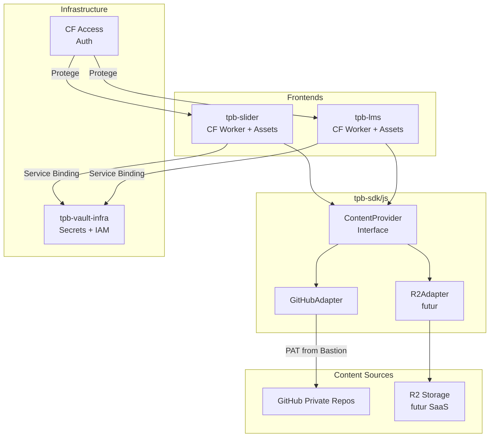

# TPB-Slider Cloud Deployment

## Contexte et Architecture Actuelle

**Ce qui existe deja :**

- `tpb-slider` : Frontend statique (HTML/CSS/JS) qui charge des JSON locaux
- `tpb-lms` : Backend avec proxy GitHub **couple** (pas d'abstraction)
- `tpb-iampam` : Pattern `InfraProvider` + adapters (a copier pour le content)
- `tpb-sdk/js` : Pattern adapter existant dans `api-broker/adapters/`
- Deploiement manuel deja fait : `pa02-roadmap.pages.dev` (CF Pages + Access)

**Le probleme du LMS actuel :** Le proxy GitHub dans `tpb-lms/backend/handlers/content.js` est directement couple a GitHub (fonctions `getGitHubContent`, `parseGitHubUrl`). Pas d'abstraction.

## Architecture Proposee



## Plan d'Implementation

### Phase 1 : Deployer tpb-slider sur Cloudflare (Quick Win)

**Objectif :** Avoir tpb-slider accessible en ligne avec authentification.

1. Creer la structure CF Worker pour tpb-slider :

   - `worker.ts` : Endpoint `/__auth/token` + serve static assets
   - `wrangler.toml` : Config CF Worker + assets

2. Deployer sur CF avec Access :

   - Meme pattern que `tpb-iampam/cf-worker-frontend`
   - Proteger avec CF Access (team `theplaybutton`)

**Fichiers a creer :**

- [`tpb-slider/worker.ts`](Apps/the-play-button/tpb-slider/worker.ts)
- [`tpb-slider/wrangler.toml`](Apps/the-play-button/tpb-slider/wrangler.toml)

### Phase 2 : ContentProvider dans tpb-sdk

**Objectif :** Abstraction propre pour charger du contenu depuis n'importe quelle source.

1. Creer l'interface `ContentProvider` dans `tpb-sdk/js/src/content/` :
```typescript
// ContentProvider.ts
export interface ContentProvider {
  fetch(uri: string): Promise<ContentResult>;
  list?(path: string): Promise<ContentItem[]>;
  canHandle(uri: string): boolean;
}

export interface ContentResult {
  content: string;
  contentType: string;
  metadata?: Record<string, string>;
}
```

2. Implementer `GitHubAdapter` :

   - Parse les URLs GitHub (raw, blob, owner/repo/path)
   - Utilise l'API GitHub avec PAT du bastion
   - Cache TTL 5min (comme le LMS actuel)

3. Creer `ContentRouter` qui selectionne le bon adapter selon l'URI :

   - `github://owner/repo/branch/path` → GitHubAdapter
   - `r2://bucket/path` → R2Adapter (futur)
   - `https://raw.githubusercontent.com/...` → GitHubAdapter

**Fichiers a creer dans `tpb-sdk/js/src/content/` :**

- `ContentProvider.ts` (interface)
- `GitHubAdapter.ts`
- `ContentRouter.ts`
- `index.ts`

### Phase 3 : Integrer ContentProvider dans tpb-slider

1. Ajouter un endpoint `/api/content` dans le worker tpb-slider
2. Utiliser `ContentRouter` de tpb-sdk
3. Service Binding vers bastion pour le PAT GitHub

**Modification de `tpb-slider/worker.ts` :**

```typescript
// Routes:
// - /__auth/token → JWT pour le frontend
// - /api/content?uri=github://... → Proxy content
// - /* → Static assets
```

### Phase 4 : Migrer le LMS vers ContentProvider

1. Remplacer `handlers/content.js` par l'import de tpb-sdk
2. Garder les memes endpoints pour compatibilite
3. Supprimer le code duplique

### Phase 5 (Future) : SaaS Features

Quand le besoin SaaS arrive :

1. Ajouter `R2Adapter` dans tpb-sdk
2. Creer D1 schema pour metadata presentations
3. Implementer upload/partage/ReBAC

## Decisions Architecturales

| Decision | Choix | Justification |

|----------|-------|---------------|

| Ou mettre ContentProvider ? | `tpb-sdk/js` | Reutilisable, versionne, pattern existant |

| Nouveau micro-service ? | Non | Chaque app embarque via tpb-sdk, plus simple |

| Service Binding vs URL ? | Service Binding | Bypass CF Access, plus performant |

| Duplication vs abstraction ? | Abstraction | Evite dette technique, facilite ajout R2 |

## Ordre d'Execution Recommande

1. **Phase 1** d'abord (1-2h) : Deploy rapide pour avoir tpb-slider en ligne
2. **Phase 2** ensuite (2-3h) : Creer l'abstraction proprement dans tpb-sdk
3. **Phase 3** (1h) : Brancher tpb-slider sur le ContentProvider
4. **Phase 4** (optionnel) : Migrer LMS quand pertinent

## Questions Ouvertes

1. **Versioning presentations :** Schema simple dans l'index.json ? (`"sliderVersion": "1.0"`)
2. **URL shortener :** Dans tpb-sdk backend ou service dedie ?
3. **ReBAC partage :** Dans tpb-slider D1 ou dans le bastion ?