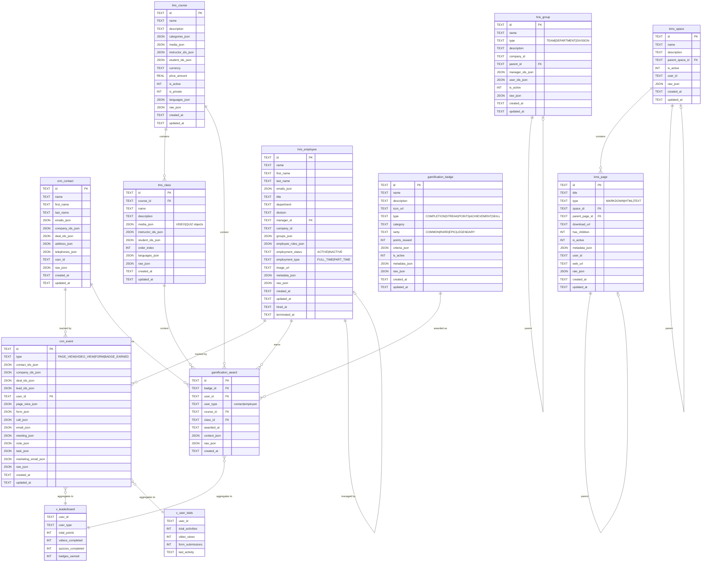

# LMS Schema - Entity Relationship Diagram

Schema aligné sur Unified.to avec extension minimale pour la gamification.

## Diagramme

## Modules

| Module | Tables | Description |
|--------|--------|-------------|
| **CRM** | `crm_contact`, `crm_event` | Contacts externes et tracking d'événements |
| **KMS** | `kms_space`, `kms_page` | Gestion de contenu Markdown |
| **LMS** | `lms_course`, `lms_class` | Cours et leçons avec médias |
| **HRIS** | `hris_employee`, `hris_group` | Employés internes et groupes |
| **Gamification** | `gamification_badge`, `gamification_award` | Badges et récompenses |
| **Views** | `v_leaderboard`, `v_user_stats` | Projections calculées |

## Points clés

1. **Alignement Unified.to** : Toutes les tables suivent les modèles Unified.to (champs, types, JSON)
2. **Extension minimale** : Seulement 2 tables ajoutées pour la gamification
3. **Pas de duplication** : Les stats sont des vues, pas des tables
4. **Flexibilité** : Champs `*_json` pour les données complexes et `raw_json` pour les données brutes

